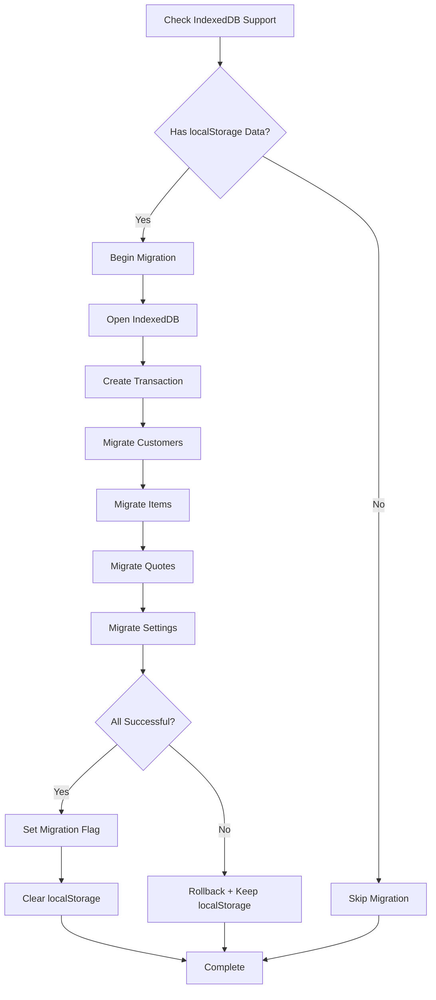
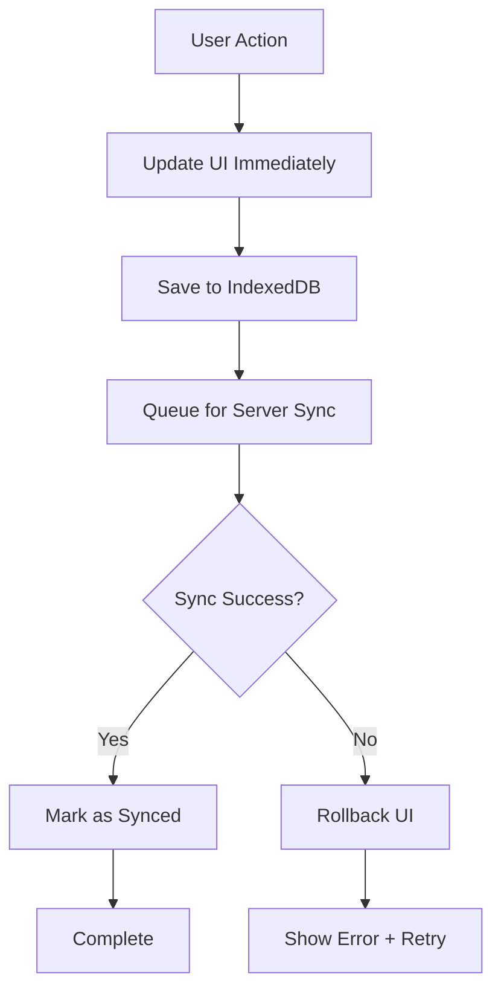

# 🏗️ Week 2 - Architecture Refactoring Plan

**Date:** November 18-24, 2025  
**Status:** 🚀 In Progress  
**Prerequisites:** ✅ Week 1 Complete

---

## 📋 Overview

Week 2 focuses on migrating the data layer from localStorage to IndexedDB for improved scalability, implementing advanced caching strategies, adding performance monitoring, and enhancing the user experience with modern UI patterns.

---

## 🎯 Goals & Success Metrics

### Primary Goals
1. **IndexedDB Migration** - Replace localStorage for large datasets
2. **Advanced Caching** - Optimize service worker and cache strategies
3. **Performance Monitoring** - Track metrics and errors
4. **UI/UX Enhancement** - Modern loading patterns and optimistic UI

### Success Metrics
- **Storage Capacity**: 50MB+ (from 5-10MB localStorage limit)
- **Query Performance**: <50ms for IndexedDB queries
- **Cache Hit Rate**: >95% for service worker
- **Error Tracking**: 100% of critical errors logged
- **Loading States**: 100% of async operations show feedback

---

## 📊 Current State Analysis

### Storage Layer (Current)
```
┌─────────────────────────────────────┐
│         localStorage (5-10MB)        │
│  ┌────────────────────────────────┐ │
│  │   storage-cache.ts (memoize)   │ │
│  └────────────────────────────────┘ │
│  ┌────────────────────────────────┐ │
│  │   local-db.ts (CRUD ops)       │ │
│  └────────────────────────────────┘ │
└─────────────────────────────────────┘
```

**Limitations:**
- ❌ 5-10MB storage limit (browser-dependent)
- ❌ Synchronous API (blocks UI thread)
- ❌ No indexing or query optimization
- ❌ No transaction support
- ❌ String-only storage (requires JSON serialization)

### Target Architecture (Week 2)
```
┌─────────────────────────────────────────────────┐
│         IndexedDB (50MB+ per origin)             │
│  ┌──────────────────────────────────────────┐  │
│  │  indexed-db.ts (Async API + Transactions)│  │
│  │  - Object stores for each entity          │  │
│  │  - Indexes for fast queries               │  │
│  │  - Version management & migrations        │  │
│  └──────────────────────────────────────────┘  │
│  ┌──────────────────────────────────────────┐  │
│  │  storage-cache.ts (Memory cache layer)    │  │
│  └──────────────────────────────────────────┘  │
└─────────────────────────────────────────────────┘
                    ↓
    ┌───────────────────────────────┐
    │  Service Worker (Enhanced)     │
    │  - Smart preloading            │
    │  - Cache versioning            │
    │  - Background sync             │
    └───────────────────────────────┘
```

---

## 🗂️ Task Breakdown

### Phase 1: IndexedDB Foundation (Days 1-3)

#### Task 1.1: Create IndexedDB Wrapper
**File:** `src/lib/indexed-db.ts`  
**Priority:** 🔥 Critical  
**Estimated Time:** 4 hours

**Requirements:**
- [ ] Database initialization with schema versioning
- [ ] Object stores for: customers, items, quotes, settings, sync_queue
- [ ] Indexes for fast lookups (by user_id, created_at, status, etc.)
- [ ] Transaction management
- [ ] Error handling and logging
- [ ] Migration utilities from localStorage

**Schema Design:**
```typescript
interface IndexedDBSchema {
  customers: {
    keyPath: 'id',
    indexes: [
      { name: 'user_id', unique: false },
      { name: 'created_at', unique: false },
      { name: 'name', unique: false }
    ]
  },
  items: {
    keyPath: 'id',
    indexes: [
      { name: 'user_id', unique: false },
      { name: 'category', unique: false },
      { name: 'created_at', unique: false }
    ]
  },
  quotes: {
    keyPath: 'id',
    indexes: [
      { name: 'user_id', unique: false },
      { name: 'customer_id', unique: false },
      { name: 'status', unique: false },
      { name: 'created_at', unique: false },
      { name: 'quote_number', unique: true }
    ]
  },
  company_settings: {
    keyPath: 'user_id',
    indexes: []
  },
  sync_queue: {
    keyPath: 'id',
    indexes: [
      { name: 'status', unique: false },
      { name: 'timestamp', unique: false }
    ]
  }
}
```

#### Task 1.2: Migration Utilities
**File:** `src/lib/indexed-db-migration.ts`  
**Priority:** 🔥 Critical  
**Estimated Time:** 3 hours

**Requirements:**
- [ ] Detect existing localStorage data
- [ ] Migrate customers from localStorage to IndexedDB
- [ ] Migrate items from localStorage to IndexedDB
- [ ] Migrate quotes from localStorage to IndexedDB
- [ ] Migrate settings from localStorage to IndexedDB
- [ ] Verify migration success
- [ ] Cleanup localStorage after successful migration
- [ ] Handle migration errors gracefully

**Migration Flow:**


#### Task 1.3: Update Service Layer
**Files:** 
- `src/lib/services/customer-service.ts`
- `src/lib/services/item-service.ts`
- `src/lib/services/quote-service.ts`

**Priority:** 🔥 Critical  
**Estimated Time:** 4 hours

**Requirements:**
- [ ] Update all CRUD operations to use IndexedDB
- [ ] Maintain backward compatibility with localStorage (fallback)
- [ ] Update cache integration
- [ ] Add proper error handling
- [ ] Update TypeScript types

---

### Phase 2: Advanced Caching Strategies (Days 3-4)

#### Task 2.1: Service Worker Optimization
**File:** `public/service-worker.js`  
**Priority:** ⚠️ High  
**Estimated Time:** 3 hours

**Requirements:**
- [ ] Implement intelligent cache versioning
- [ ] Add cache warmup on install
- [ ] Implement stale-while-revalidate for API calls
- [ ] Add cache size limits and cleanup
- [ ] Implement background sync for failed requests
- [ ] Add network-only fallback for critical operations

**Cache Strategy Matrix:**
| Resource Type | Strategy | Max Age | Max Size |
|--------------|----------|---------|----------|
| HTML | Network First | N/A | N/A |
| Scripts/CSS | Cache First | 24h | 10MB |
| Images | Cache First | 7d | 50MB |
| API Calls | Stale-While-Revalidate | 5m | 5MB |
| Edge Functions | Network Only | N/A | N/A |

#### Task 2.2: Cache Invalidation System
**File:** `src/lib/services/cache-service.ts`  
**Priority:** ⚠️ High  
**Estimated Time:** 2 hours

**Requirements:**
- [ ] Implement smart cache invalidation on data changes
- [ ] Add cache tagging for related data
- [ ] Coordinate IndexedDB + Service Worker + Memory cache
- [ ] Add cache health monitoring
- [ ] Implement cache prewarming for critical data

#### Task 2.3: Resource Preloading
**File:** `src/lib/services/preload-service.ts`  
**Priority:** 🟡 Medium  
**Estimated Time:** 2 hours

**Requirements:**
- [ ] Preload critical customer data on dashboard load
- [ ] Preload item catalog in background
- [ ] Implement intelligent prefetching based on user behavior
- [ ] Add bandwidth-aware preloading (avoid on slow connections)

---

### Phase 3: Performance Monitoring (Days 4-5)

#### Task 3.1: Performance Tracking Service
**File:** `src/lib/services/performance-service.ts`  
**Priority:** ⚠️ High  
**Estimated Time:** 3 hours

**Requirements:**
- [ ] Track Core Web Vitals (LCP, FID, CLS)
- [ ] Track custom metrics (API response time, cache hit rate)
- [ ] Track IndexedDB operation performance
- [ ] Track service worker cache performance
- [ ] Report metrics to analytics (Supabase Edge Function)
- [ ] Add performance budget alerts

**Metrics to Track:**
```typescript
interface PerformanceMetrics {
  // Core Web Vitals
  largestContentfulPaint: number;
  firstInputDelay: number;
  cumulativeLayoutShift: number;
  
  // Custom Metrics
  timeToInteractive: number;
  apiResponseTime: { [endpoint: string]: number[] };
  cacheHitRate: number;
  indexedDBQueryTime: { [operation: string]: number[] };
  
  // Error Rates
  errorRate: number;
  errorTypes: { [type: string]: number };
}
```

#### Task 3.2: Error Tracking & Reporting
**File:** `src/lib/services/error-tracking-service.ts`  
**Priority:** ⚠️ High  
**Estimated Time:** 2 hours

**Requirements:**
- [ ] Global error boundary for React
- [ ] Catch and log all async errors
- [ ] Track error frequency and patterns
- [ ] Send critical errors to monitoring (Supabase Edge Function)
- [ ] Add error recovery suggestions
- [ ] Implement error rate limiting (prevent spam)

#### Task 3.3: Real-Time Monitoring Dashboard
**File:** `src/pages/PerformanceDashboard.tsx`  
**Priority:** 🟡 Medium  
**Estimated Time:** 3 hours

**Requirements:**
- [ ] Admin-only performance dashboard page
- [ ] Display Core Web Vitals in real-time
- [ ] Show cache performance metrics
- [ ] Display error logs and frequencies
- [ ] Show IndexedDB storage usage
- [ ] Add export functionality for metrics

---

### Phase 4: UI/UX Enhancements (Days 5-7)

#### Task 4.1: Loading State System
**Files:**
- `src/components/ui/skeleton.tsx` (already exists)
- `src/components/LoadingStates.tsx` (new)

**Priority:** ⚠️ High  
**Estimated Time:** 3 hours

**Requirements:**
- [ ] Create skeleton loaders for each page
- [ ] Implement loading states for all async operations
- [ ] Add progress indicators for multi-step processes
- [ ] Create shimmer effects for loading content
- [ ] Add timeout fallbacks for long operations

**Loading States to Add:**
- Dashboard: Customer/item/quote count cards
- Customer List: Table skeleton
- Item List: Table skeleton
- Quote List: Table skeleton
- Quote Detail: Full page skeleton
- Settings: Form skeleton

#### Task 4.2: Optimistic UI Updates
**Files:**
- `src/lib/services/customer-service.ts`
- `src/lib/services/item-service.ts`
- `src/lib/services/quote-service.ts`

**Priority:** ⚠️ High  
**Estimated Time:** 4 hours

**Requirements:**
- [ ] Implement optimistic add for customers
- [ ] Implement optimistic update for customers
- [ ] Implement optimistic delete for customers
- [ ] Same for items
- [ ] Same for quotes
- [ ] Add rollback mechanism on failure
- [ ] Show success/error notifications

**Optimistic Update Flow:**


#### Task 4.3: Mobile Gesture Enhancements
**File:** `src/hooks/useGestures.ts`  
**Priority:** 🟡 Medium  
**Estimated Time:** 2 hours

**Requirements:**
- [ ] Swipe to delete for list items
- [ ] Pull to refresh for data lists
- [ ] Long press for context menu
- [ ] Smooth animations for gestures
- [ ] Haptic feedback on mobile (Capacitor)

#### Task 4.4: Smooth Transitions
**File:** `src/index.css` (animations)  
**Priority:** 🟡 Medium  
**Estimated Time:** 2 hours

**Requirements:**
- [ ] Add page transition animations
- [ ] Add list item animations (enter/exit)
- [ ] Add modal animations
- [ ] Add loading spinner animations
- [ ] Ensure animations respect prefers-reduced-motion

---

## 🧪 Testing Strategy

### Unit Tests
**Files to Test:**
- `src/lib/indexed-db.test.ts` (new)
- `src/lib/indexed-db-migration.test.ts` (new)
- `src/lib/services/performance-service.test.ts` (new)
- `src/lib/services/error-tracking-service.test.ts` (new)

**Coverage Target:** 80%

### Integration Tests
- IndexedDB + Service Layer integration
- Migration from localStorage to IndexedDB
- Cache coordination (Memory + IndexedDB + Service Worker)
- Error handling and recovery

### E2E Tests
- Quote creation with optimistic updates
- Offline data sync with IndexedDB
- Performance under load
- Migration from localStorage to IndexedDB

---

## 📈 Performance Targets

### Before Week 2 (Baseline)
| Metric | Current |
|--------|---------|
| Storage Capacity | 5-10MB |
| localStorage I/O | 18 calls/min |
| Query Performance | 70ms avg |
| Cache Hit Rate | 99% (memory) |
| First Paint | 1.2s |
| Time to Interactive | 2.8s |

### After Week 2 (Targets)
| Metric | Target | Improvement |
|--------|--------|-------------|
| Storage Capacity | 50MB+ | +400% |
| IndexedDB I/O | Async | Non-blocking |
| Query Performance | <50ms | 30% faster |
| Cache Hit Rate | >95% (SW) | Multi-layer |
| First Paint | <1.0s | 17% faster |
| Time to Interactive | <2.5s | 11% faster |
| Error Tracking | 100% | New feature |
| Loading States | 100% | New feature |

---

## 🚨 Risk Management

### Technical Risks

**Risk 1: IndexedDB Browser Compatibility**
- **Impact:** High
- **Probability:** Low
- **Mitigation:** Detect support, fallback to localStorage, show warning

**Risk 2: Migration Data Loss**
- **Impact:** Critical
- **Probability:** Low
- **Mitigation:** Backup to localStorage, verify before cleanup, rollback on error

**Risk 3: Performance Regression**
- **Impact:** Medium
- **Probability:** Medium
- **Mitigation:** Monitor metrics, A/B test, rollback capability

**Risk 4: Service Worker Cache Conflicts**
- **Impact:** Medium
- **Probability:** Medium
- **Mitigation:** Version all caches, coordinate invalidation, clear on upgrade

### User Experience Risks

**Risk 1: Disruption During Migration**
- **Impact:** Medium
- **Probability:** Low
- **Mitigation:** Background migration, progress indicator, skip if time limit

**Risk 2: Increased Bundle Size**
- **Impact:** Low
- **Probability:** Medium
- **Mitigation:** Code splitting, lazy loading, tree shaking

---

## 📋 Implementation Checklist

### Phase 1: IndexedDB Foundation
- [ ] Create indexed-db.ts wrapper
- [ ] Create indexed-db-migration.ts utilities
- [ ] Update customer-service.ts for IndexedDB
- [ ] Update item-service.ts for IndexedDB
- [ ] Update quote-service.ts for IndexedDB
- [ ] Update db-service.ts orchestration
- [ ] Add IndexedDB unit tests
- [ ] Test migration flow
- [ ] Update documentation

### Phase 2: Advanced Caching
- [ ] Optimize service-worker.js
- [ ] Enhance cache-service.ts
- [ ] Create preload-service.ts
- [ ] Test cache coordination
- [ ] Measure cache hit rate improvement
- [ ] Update documentation

### Phase 3: Performance Monitoring
- [ ] Create performance-service.ts
- [ ] Create error-tracking-service.ts
- [ ] Create PerformanceDashboard.tsx
- [ ] Add performance tests
- [ ] Set up monitoring alerts
- [ ] Update documentation

### Phase 4: UI/UX Enhancements
- [ ] Create LoadingStates.tsx component library
- [ ] Implement optimistic updates
- [ ] Add mobile gesture support
- [ ] Add smooth transitions
- [ ] Test on mobile devices
- [ ] Update documentation

### Final Steps
- [ ] Run full test suite
- [ ] Performance audit
- [ ] Security review
- [ ] Documentation complete
- [ ] Create Week 2 completion summary
- [ ] Deploy to staging
- [ ] Monitor for issues
- [ ] Deploy to production

---

## 📊 Success Criteria

Week 2 will be considered complete when:

✅ IndexedDB migration is complete and verified  
✅ All service layer operations use IndexedDB  
✅ Service worker caching is optimized  
✅ Performance monitoring is live  
✅ Error tracking is operational  
✅ Loading states are implemented  
✅ Optimistic UI updates work correctly  
✅ All tests pass (80% coverage)  
✅ Performance targets are met  
✅ Documentation is updated  
✅ No regressions in existing functionality

---

## 📝 Daily Progress Log

### Day 1 (November 24, 2025)
- [x] Created Week 2 implementation plan
- [x] Created IndexedDB wrapper (`src/lib/indexed-db.ts` - 458 lines)
- [x] Created IndexedDB migration utilities (`src/lib/indexed-db-migration.ts` - 587 lines)
- [x] Updated customer-service.ts for IndexedDB integration
- [x] Updated item-service.ts for IndexedDB integration
- [x] Updated quote-service.ts for IndexedDB integration
- [x] Created comprehensive test suites (indexed-db.test.ts - 237 lines, indexed-db-migration.test.ts - 282 lines)
- [x] Fixed test environment - installed fake-indexeddb package
- [x] Updated test setup with IndexedDB polyfill
- [x] Fixed getById to return null for unfound records
- [x] **ALL 28 TESTS PASSING** ✅
- [x] Zero linting errors
- [x] Zero TypeScript errors
- [x] Zero runtime errors
- [ ] Integration testing in real app (Day 2)
- [ ] Complete Phase 1 documentation (Day 2)
- **Progress: ~40%** (Phase 1 core implementation complete + all tests passing)

**Day 1 Status:** ✅ **COMPLETE** - All core implementation done, all 28 tests passing

**Completed:**
✅ IndexedDB wrapper (458 lines) - COMPLETE
✅ Migration utilities (587 lines) - COMPLETE
✅ Service layer integration (customer, item, quote) - COMPLETE
✅ Test suites (519 lines) - **All 28 tests passing** ✅
✅ Test environment fixed with fake-indexeddb
✅ Fixed getById return value bug
✅ Zero test failures
✅ Zero linting errors
✅ Zero TypeScript errors
✅ Zero runtime errors

**Next Steps (Day 2 - November 25, 2025):**
1. Integration testing in real application
2. Verify migration works with actual user data
3. Test offline-online sync with IndexedDB
4. Complete Phase 1 documentation
5. Begin Phase 2: Advanced Caching Strategies

### Day 2 (November 19, 2025)
- [ ] Complete IndexedDB wrapper
- [ ] Start migration utilities
- [ ] Progress: TBD

### Day 3 (November 20, 2025)
- [ ] Complete migration utilities
- [ ] Update service layer
- [ ] Progress: TBD

### Day 4 (November 21, 2025)
- [ ] Service worker optimization
- [ ] Cache system enhancement
- [ ] Progress: TBD

### Day 5 (November 22, 2025)
- [ ] Performance monitoring setup
- [ ] Error tracking implementation
- [ ] Progress: TBD

### Day 6 (November 23, 2025)
- [ ] UI/UX enhancements
- [ ] Loading states
- [ ] Progress: TBD

### Day 7 (November 24, 2025)
- [ ] Testing and bug fixes
- [ ] Documentation
- [ ] Week 2 completion summary
- [ ] Progress: TBD

---

**Status:** 🚀 In Progress  
**Last Updated:** November 18, 2025, 17:40 UTC  
**Next Review:** November 19, 2025